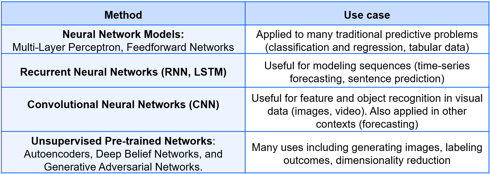
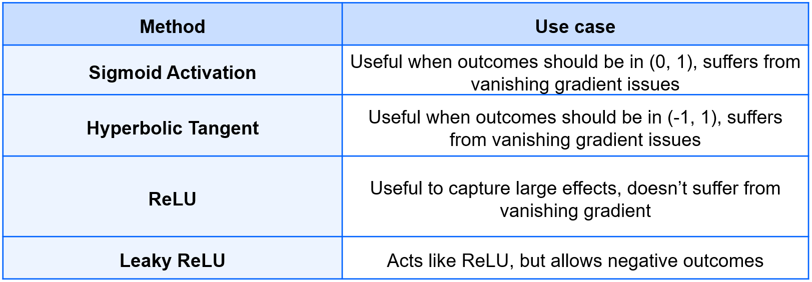

# Review

Exercises:

- [05a_DEMO_Gradient_Descent.ipynb](https://colab.research.google.com/github/iliyaML/ibm-machine-learning/blob/main/deep-learning/05a_DEMO_Gradient_Descent.ipynb)
- [05b_LAB_Intro_NN.ipynb](https://colab.research.google.com/github/iliyaML/ibm-machine-learning/blob/main/deep-learning/05b_LAB_Intro_NN.ipynb)
- [05c_DEMO_Backpropagation.ipynb](https://colab.research.google.com/github/iliyaML/ibm-machine-learning/blob/main/deep-learning/05c_DEMO_Backpropagation.ipynb)
- [05d_LAB_Keras_Intro.ipynb](https://colab.research.google.com/github/iliyaML/ibm-machine-learning/blob/main/deep-learning/05d_LAB_Keras_Intro.ipynb)
- [05e_DEMO_CNN.ipynb](https://colab.research.google.com/github/iliyaML/ibm-machine-learning/blob/main/deep-learning/05e_DEMO_CNN.ipynb)
- [05f_DEMO_Transfer_Learning.ipynb](https://colab.research.google.com/github/iliyaML/ibm-machine-learning/blob/main/deep-learning/05f_DEMO_Transfer_Learning.ipynb)
- [05g_DEMO_RNN.ipynb](https://colab.research.google.com/github/iliyaML/ibm-machine-learning/blob/main/deep-learning/05g_DEMO_RNN.ipynb)
- [05h_LAB_Autoencoders.ipynb](https://colab.research.google.com/github/iliyaML/ibm-machine-learning/blob/main/deep-learning/05i_DEMO_Reinforcement.ipynb)
- [05i_DEMO_Reinforcement.ipynb](https://colab.research.google.com/github/iliyaML/ibm-machine-learning/blob/main/deep-learning/05i_DEMO_Reinforcement.ipynb)

## Introduction to Neural Networks

Neural Networks and Deep Learning are behind most of the AI that shapes our everyday life. Think of how you interact everyday with these technologies just by using the greatest features in our phones (face-recognition, autocorrect, text-autocomplete, voicemail-to-text previews), finding what we need on the internet (predictive internet searches, content or product recommendations), or using self-driving cars. Also, some of the classification and regression problems you need to solve, are good candidates for Neural Networks and Deep Learning as well.

Some basic facts of Neural Networks:

- Use biology as inspiration for mathematical models
- Get signals from previous neurons
- Generate signals according to inputs
- Pass signals on to next neurons
- You can create a complex model by layering many neurons

The basic syntax of Multi-Layer Perceptrons in scikit learn is:

### Import Scikit-Learn model

```python
from sklearn.neural_network import MLPClassifier
```

### Specify an activation function

```python
mlp = MLPClassifier(hidden_layer_sizes=(5,2), activation= 'logistic')
```

#### Fit and predict data (similar to approach for other sklearn models)

```python
mlp.fit(X_train, y_train)
mlp.predict(X_test)
```

These are the main parts of MLP:

- Weights
- Input layer
- Hidden Layer
- Weights
- Net Input
- Activation

### Deep Learning Use Cases Summary



### Training a Neural Network

In a nutshell this is the process to train a neural network:

- Put in Training inputs, get the output.
- Compare output to correct answers: Look at loss function J.
- Adjust and repeat.
- Backpropagation tells us how to make a single adjustment using calculus.

The vanishing gradient problem is caused due to the fact that as you have more layers, the gradient gets very small at the early layers. For this reason, other activations (such as ReLU) have become more common

The right activation function depends on the application, and there are no hard and fast rules. These are the some of the most used activation functions and their most common use cases:



## Deep Learning and Regularization

Technically, a deep Neural Network has 2 or more hidden layers (often, many more). Deep Learning involves Machine Learning with deep Neural Networks. However, the term Deep Learning is often used to broadly describe a subset of Machine Learning approaches that use deep Neural Networks to uncover otherwise-unobservable relationships in the data, often as an alternative to manual feature engineering. Deep Learning approaches are common in Supervised, Unsupervised, and Semi-supervised Machine Learning.

These are some common ways to prevent overfitting and regularize neural networks:

- Regularization penalty in cost function - This option explicitly adds a penalty to the loss function

- Dropout - This is a mechanism in which at each training iteration (batch) we randomly remove a subset of neurons. This prevents a neural network from relying too much on individual pathways, making it more robust. At test time the weight of the neuron is rescaled to reflect the percentage of the time it was active.

- Early stopping - This is another heuristic approach to regularization that refers to choosing some rules to determine if the training should stop.

Example:

Check the validation log-loss every 10 epochs.

If it is higher than it was last time, stop and use the previous model.

- Optimizers - This approaches are based on the idea of tweaking and improving the weights using other methods instead of gradient descent.

## Details of Neural Networks

Training Neural Networks is sensitive to how to compute the derivative of each weight and how to reach convergence. Important concepts that are involved at this step:

Batching methods, which includes techniques like full-batch, mini-batch, and stochastic gradient descent, get the derivative for a set of points

Data shuffling, which aids convergence by making sure data is presented in a different order every epoch.

## Keras

Keras is a high-level library that can run on either TensorFlow or Theano. It simplifies the syntax, and allows multiple backend tools, though it is most commonly used with TensorFlow.

This is a common approach to train a deep learning model using Keras:

1. Compile the model, specifying your loss function, metrics, and optimizer.
2. Fit the model on your training data (specifying batch size, number of epochs).
3. Predict on new data.
4. Evaluate your results.

Below is the syntax to create a sequential model in Keras.

First, import the Sequential function and initialize your model object:

```python
from keras.models import Sequential

model = Sequential()
```

Then add layers to the model one by one:

```python
from keras.layers import Dense, Activation
```

# Import libraries, model elements

```python
from keras.models import Sequential
from keras.layers import Dense, Activation

model = Sequential()
```

#### For the first layer, specify the input dimension

```python
model.add(Dense(units=4, input_dim=3))
```

### Specify activation function

```python
model.add(Activation('sigmoid'))
```

### For subsequent layers, the input dimension is presumed from the previous layer model.add(Dense(units=4))

```python
model.add(Activation('sigmoid'))
```
